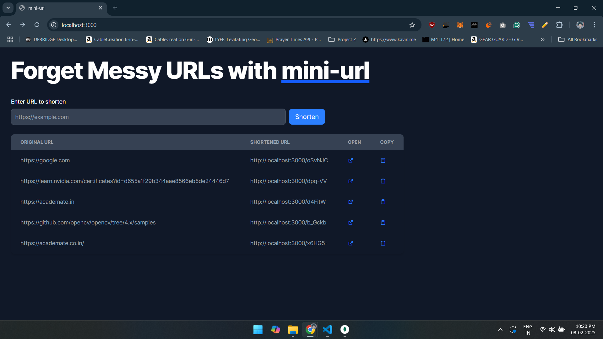
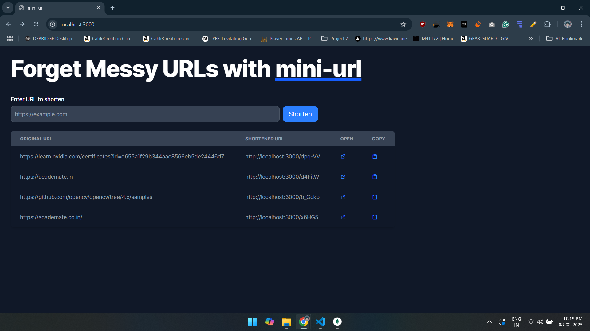

# Mini-URL - A Simple URL Shortener

Mini-URL is a lightweight and efficient URL shortener built using **Node.js, Express, MongoDB, and Tailwind CSS (Flowbite)**. It provides a seamless way to shorten long URLs and store them in a MongoDB database for future access.



## Features
✅ Shorten long URLs quickly
✅ Store & retrieve shortened URLs from MongoDB
✅ Open and copy shortened links easily
✅ Dynamic domain adaptation (works with localhost & deployed URLs)
✅ Responsive UI built with Tailwind CSS & Flowbite

---

## 🚀 Tech Stack
- **Backend:** Node.js, Express.js, MongoDB
- **Frontend:** HTML, Tailwind CSS (Flowbite), JavaScript
- **Database:** MongoDB
- **Containerization:** Docker (yet to)

---

## 📦 Installation
### 1️⃣ Clone the Repository
```sh
git clone https://github.com/yourusername/mini-url.git
cd mini-url
```

### 2️⃣ Install Dependencies
```sh
npm install
```

### 3️⃣ Set Up MongoDB
Make sure MongoDB is running locally or use **MongoDB Atlas**. Update your `.env` file with:
```env
MONGO_URI=mongodb://0.0.0.0/mini-url
```

### 4️⃣ Run the Server
```sh
npm start
```
Your app will be live at **http://localhost:3000** 🚀

---

## 🌍 Deployment
### Deploy on Render/Vercel
- Use **Render** or **Vercel** for easy deployment.
- Set up environment variables (`MONGO_URI`) in the dashboard.

---

## 🔗 Usage
1️⃣ Enter a long URL in the input field.
2️⃣ Click **Submit** to generate a short URL.
3️⃣ The shortened URL appears in the table below.
4️⃣ Click **Open** to visit the link or **Copy** to copy it.



---

## 🎯 API Endpoints
### ➤ Shorten a URL
```http
POST /shorten
```
**Request Body:**
```json
{ "url": "https://example.com" }
```
**Response:**
```json
{ "shortUrl": "http://yourdomain.com/abc123" }
```

### ➤ Redirect to Original URL
```http
GET /:shortId
```
**Example:** `GET /abc123` → Redirects to `https://example.com`

### ➤ Fetch All Stored URLs
```http
GET /links
```

---

## 🤝 Contributing
Feel free to **fork** the repo, create a **feature branch**, and submit a **pull request**!

---

## 📜 License
This project is licensed under the **MIT License**.

---

### 💡 Have Ideas or Issues?
Open an **issue** or **start a discussion** in the repo!

Enjoy shortening URLs with **Mini-URL**! 🚀

